# Setup OCI Account

Cloud Free Tier allows you to sign up for an Oracle Cloud account which provides a number of Always Free services and a Free Trial with US$300 of free credit to use on all eligible Oracle Cloud Infrastructure services for up to 30 days. The Always Free services are available for an unlimited period of time. The Free Trial services may be used until your US$300 of free credits are consumed or the 30 days has expired, whichever comes first (see https://www.oracle.com/sg/cloud/free/faq/).

* To sign up for an Oracle Cloud Free Tier Account, please, visit https://www.oracle.com/mysql/free/, and click on *Start for free* on OCI.
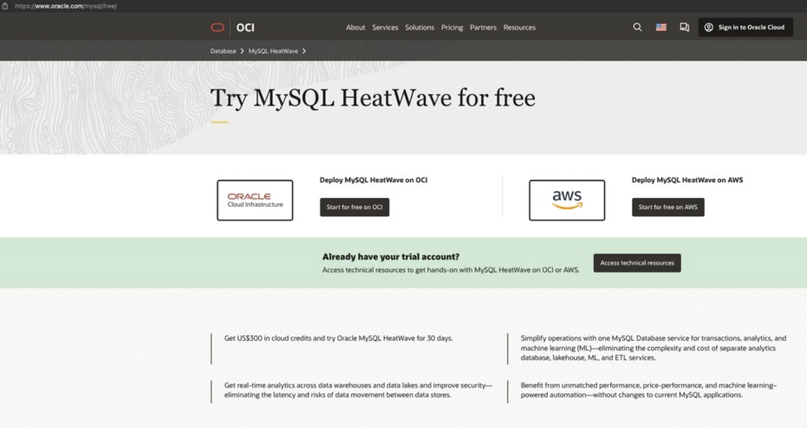

* On the sign up page, enter Country/Territory, First Name, Last Name and Email Address, then read Terms of Use, fill out the Captcha and click on *Verify my email*.
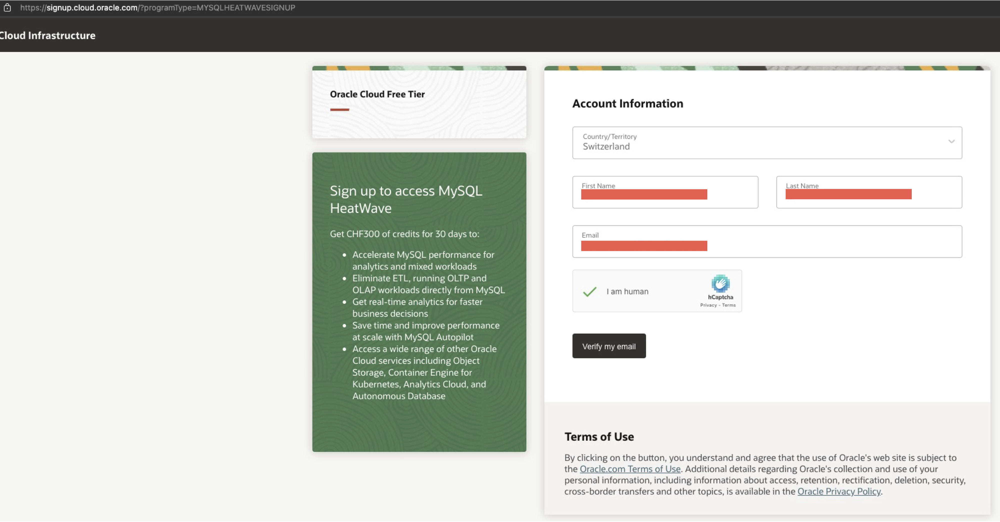

* Access your email and click on the Verify email link.

* Create a password according to the requirements, select *Individual* as Customer type, choose a cloud account name and a Home Region, click on the checkbox and then *Continue*.
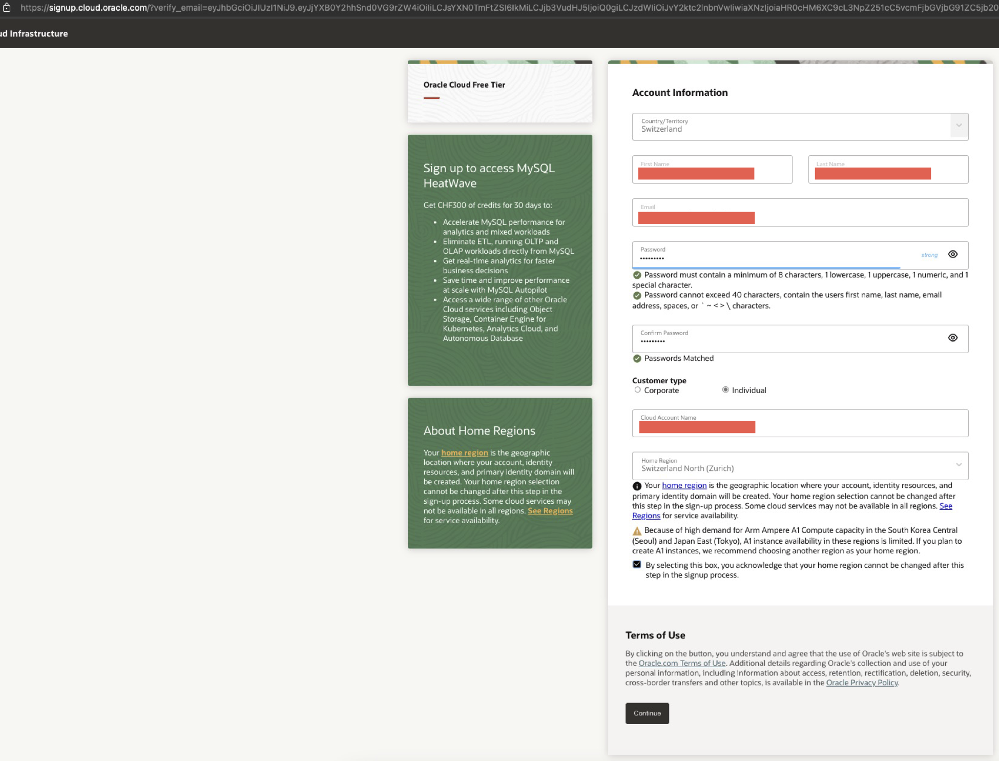

* Add your address information and your phone number, then click on *Continue*.
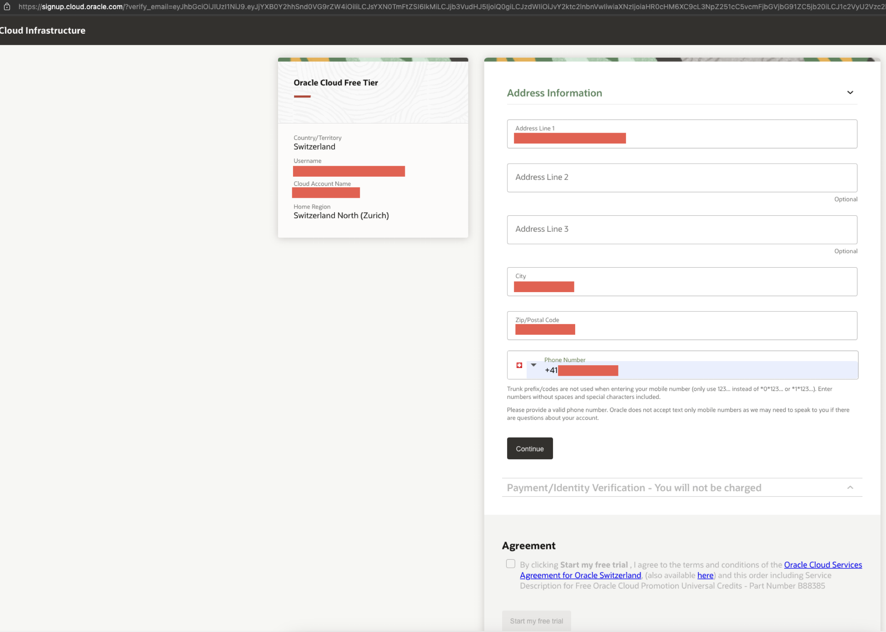

* Click on *Add payment verification method*, add your credit card details (note that *you won't be charged* unless you elect to upgrade your account to Paid tier). Then check the agreement checkbox and click on *Start my free trial*.
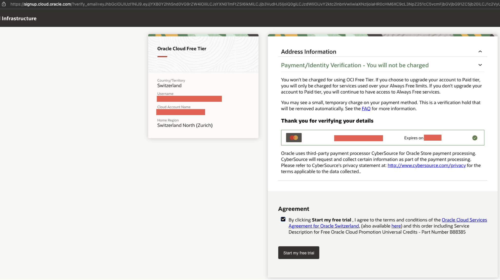

* Wait while the account is provisioned (don't close the tab).
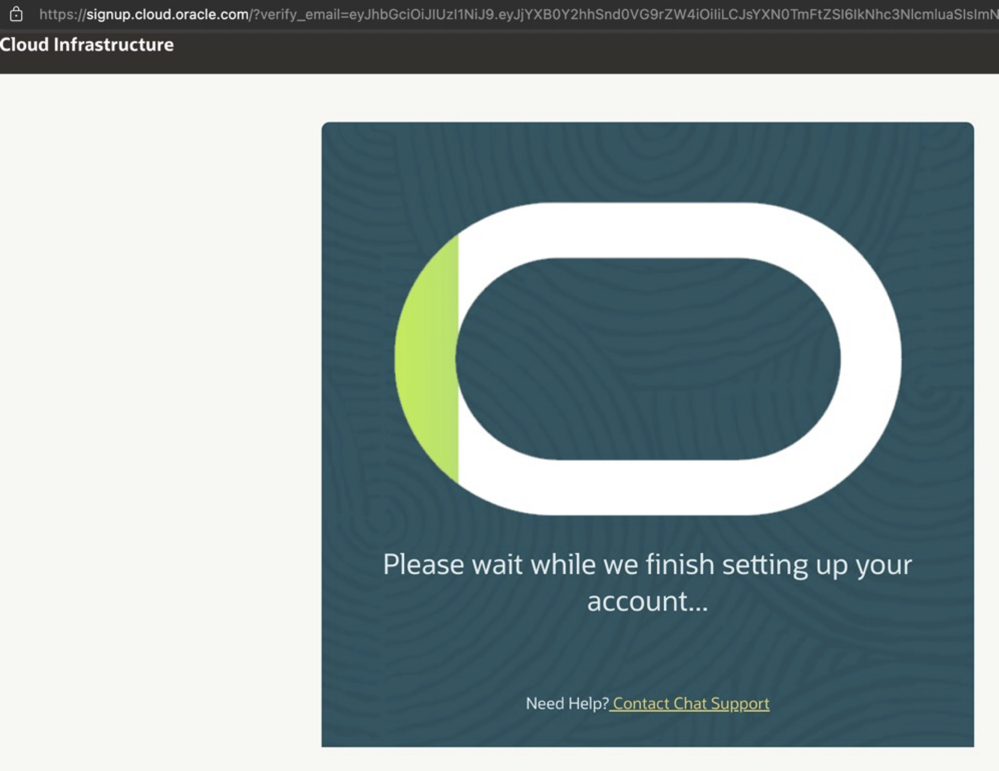

* After a couple of minutes, you should be redirected to the sign in page. First add your cloud account name and click on *Next*.
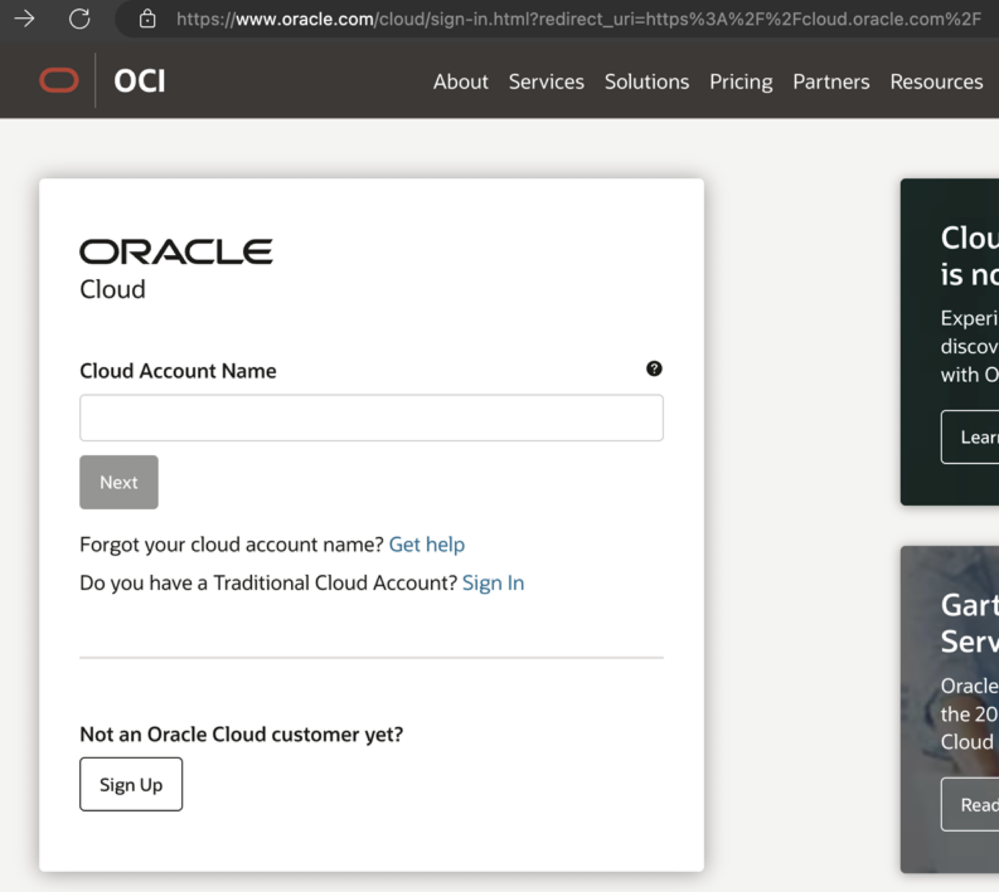

* Then, add your username and password.
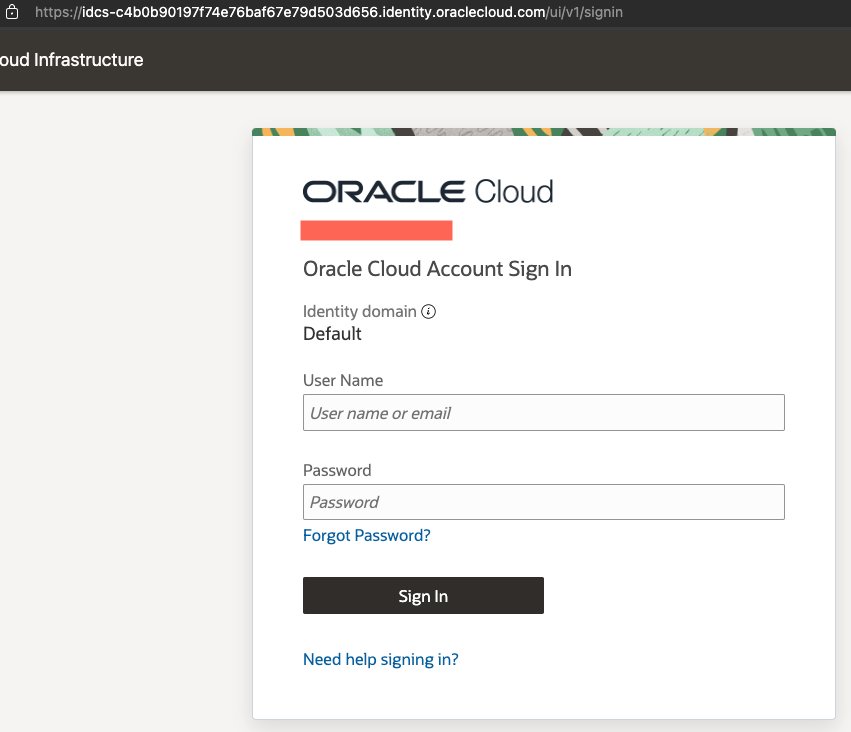

* The final step is enabling MFA verification. Follow the instructions to download and configure the Oracle Mobile Authenticator App. After scanning the QR code the page should refresh and recognize that a second factor has been added.
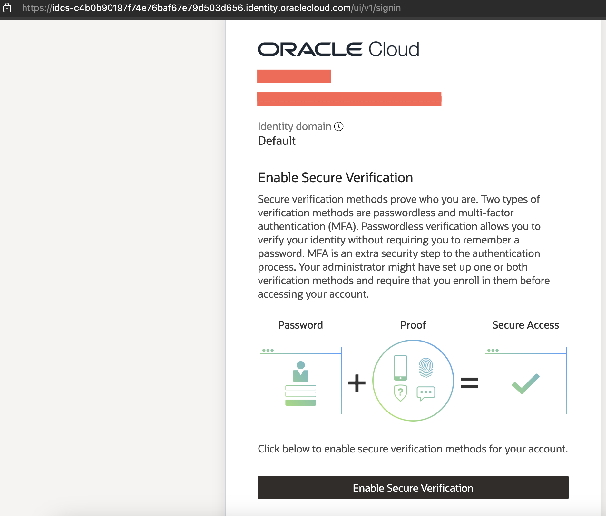
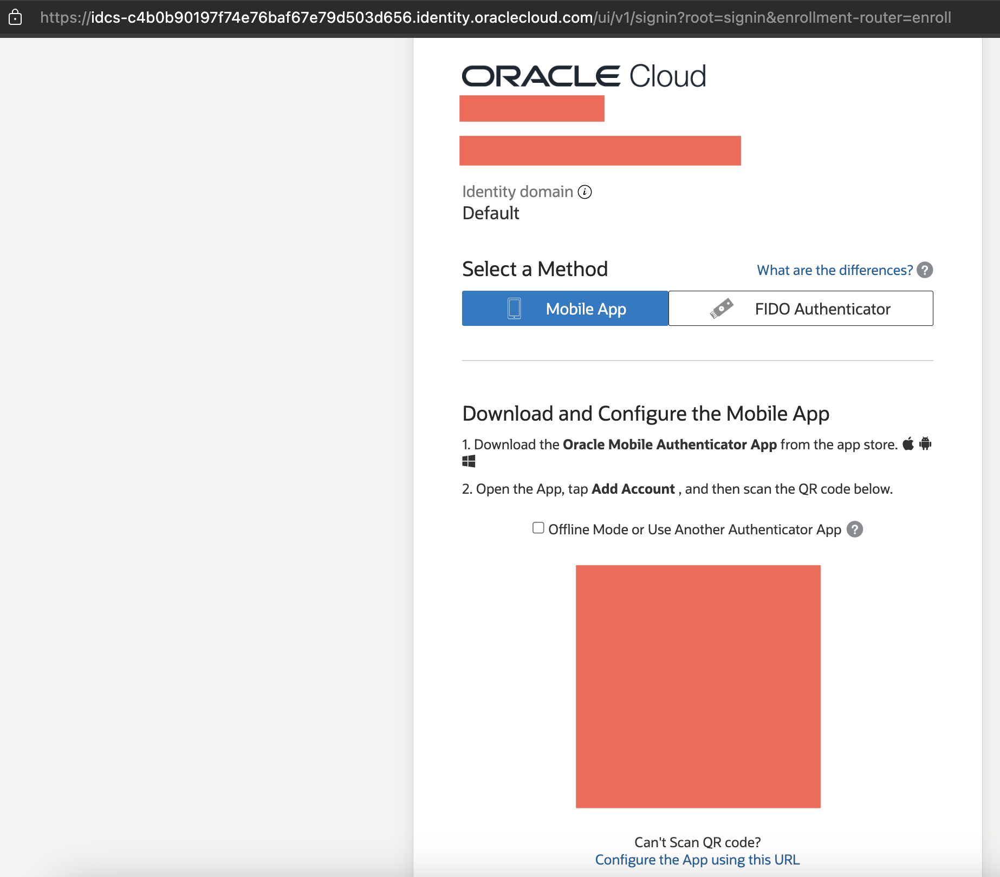

* You are in the OCI Console now. Congratulations!
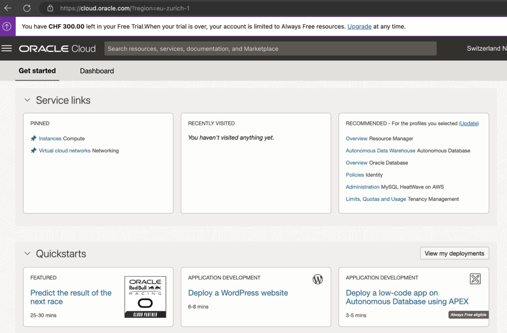
