# Create a Virtual Cloud Network and Allow Traffic Through MySQL Database Service Port

Welcome to the first step of our workshop on "Automated Machine Learning from Your Database System with MySQL HeatWave Cloud Service". In this section, we'll guide you through the process of creating a **Virtual Cloud Network (VCN)** in your cloud environment and configuring it to allow traffic through the MySQL Database Service port.

## Objectives
By the end of this guide, you will have:

- Created a Virtual Cloud Network (VCN) in your Oracle Cloud Infrastructure (OCI).
- Configured the VCN to allow inbound traffic on the MySQL Database Service port (default: 3306).

## Prerequisites

- An active Oracle Cloud account.
- Basic understanding of networking concepts.

## Understanding Key Concepts
Before diving into the setup process, let's clarify some essential networking concepts you'll be working with:

    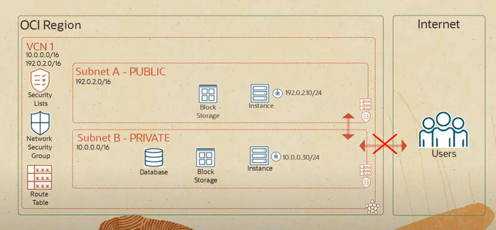

### Virtual Cloud Network (VCN)
**What is it?** A VCN is a customizable and private network in the cloud. It's similar to a traditional network that you'd operate in your own data center, but with the benefits of scalable cloud infrastructure. You have complete control over your virtual networking environment, including your own private IP address range, subnet creation, route tables, and network gateways.

**Why is it important?** Creating a VCN is one of the first steps in setting up cloud-based resources. It provides a secure environment where your cloud resources such as VMs, databases, and applications can run safely and communicate with each other.

### Security Lists
**What are they?** Security lists act as virtual firewalls for your VCN, with rules that specify the types of traffic (ingress and egress) allowed in and out of the resources connected to the subnets. Each rule is stateful, meaning return traffic automatically matches regardless of the rule's egress or ingress designation.

**Why use them?** They are essential for controlling access to your resources, ensuring that only permitted traffic can enter or leave your network, thereby enhancing the security of your cloud environment.

### Ingress Rules
**What are they?** These are rules within your security list that control incoming traffic to your subnet, allowing you to specify accessible ports, source IP ranges, and protocols.

**Why are they important?** Ingress rules are crucial for enabling external clients or applications to interact with your cloud services, such as accessing your MySQL database.

### CIDR Notation
**What is it?** Classless Inter-Domain Routing (CIDR) notation is a method for specifying IP addresses and their associated routing prefix. It's a compact representation of an IP address and its associated network mask.

**Why is it used?** CIDR notation is used to define the range of IP addresses that can access a particular resource, allowing you to control network traffic precisely.

### Subnet 
**What is it?** A subnet is a subdivision of a VCN. It represents a range of IP addresses that can be allocated to cloud resources, such as VMs and databases. Subnets allow you to segment your VCN and allocate IP addresses in a way that aligns with your network design and security requirements.

**Why is it used?** They enable you to distribute your cloud resources across different logical segments within a VCN, often to enhance security, improve network efficiency, or comply with regulatory requirements. Each subnet can have its own route table, security list, and network security group, providing a way to apply fine-grained access control and traffic routing rules.

More information about OCI Networking can be found in the [documentation](https://docs.oracle.com/en-us/iaas/Content/Network/Concepts/overview.htm).

## Step-by-Step Guide

### Step 1: Sign in to Your Oracle Cloud Account
Navigate to the [Oracle Cloud login page](https://www.oracle.com/cloud/sign-in.html) and sign in using your credentials.

### Step 2: Access the Virtual Cloud Network Section
- Once logged in, go to the main dashboard.
- Navigate to the **“Networking”** section and select **“Virtual Cloud Networks”**.

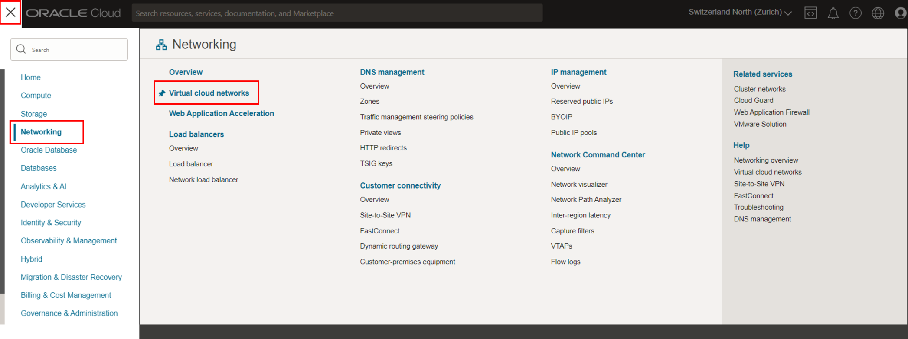

### Step 3: Create a New Virtual Cloud Network (VCN) using VCN Wizard

- Click on **"Start VCN Wizard"**.

The OCI VCN Wizard is a tool provided by Oracle to simplify the process of setting up and configuring a Virtual Cloud Network in their cloud environment. This wizard is particularly beneficial for users who may not be deeply familiar with networking concepts or those who wish to streamline the network creation process. 

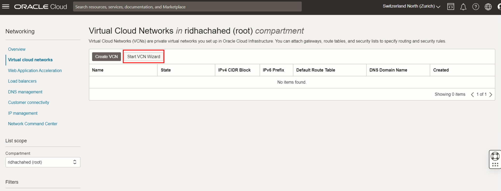

The wizard offers several pre-configured templates that match to different use cases or deployment scenarios. These templates might include configurations for:

- A public subnet with an internet gateway: Suitable for applications that need to be publicly accessible, like web servers.
- A combination of public and private subnets: A common architecture for applications that have both public-facing components and backend systems that should not be directly exposed to the internet.

By selecting one of these templates, users can quickly set up a VCN that matches their application's architectural requirements, ensuring that the network is configured correctly and securely.

- For our use case, click on **"Create VCN with Internet Connectivity"**
- Confirm you choice by clicking on **"Start VCN Wizard"**

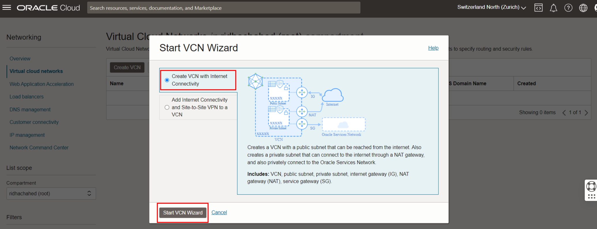

By selecting the VCN with Internet Connectivity, the OCI VCN Wizard automates the setup of several resources within your cloud environment:

- **Virtual Cloud Network (VCN)**: This is a customizable private network in the cloud that provides an isolated environment for your cloud resources, enabling you to define your own IP address space, create subnets, and configure route tables along with internet connectivity.

- **Public Subnets**: These are segments of your VCN designated to host resources that need to be accessible from the internet; the OCI VCN Wizard configures these subnets with route rules that direct internet-bound traffic to the Internet Gateway, enabling resources within these subnets, such as web servers, to be reached from the outside world.

- **Private Subnets**: In contrast, private subnets are designed for resources that should not be directly accessible from the internet; they are typically used for backend systems that only need to communicate with other resources within the cloud environment, and the OCI VCN Wizard configures these without direct routes to the Internet Gateway, often relying on a NAT Gateway for outbound internet access without exposing the resources to inbound internet traffic.

- **Internet Gateway (IGW)**: An essential gateway that connects your VCN to the internet, it allows resources within the public subnet of your VCN to access and be accessed from the internet, facilitating both inbound and outbound internet connectivity.

- **NAT Gateway** : It allows instances in private subnets to connect to the internet or other Oracle services while preventing the internet from initiating a connection with those instances, ensuring that resources can securely access external services without being exposed to direct internet access.

- **Route Tables**: These contain rules that determine how traffic is directed outside the VCN, typically set up to direct outbound internet traffic through the Internet Gateway, thereby enabling resources in the VCN to communicate with the internet.

- **Security Lists**: These function as virtual firewalls for each subnet, containing stateful rules that specify allowed and disallowed inbound and outbound traffic, thereby helping to secure your cloud resources against unauthorized access.

- **Public IP Addresses**: Assignable to individual resources within your VCN, these IP addresses make your resources accessible from the internet, necessary for any service you wish to expose publicly, like a web server

    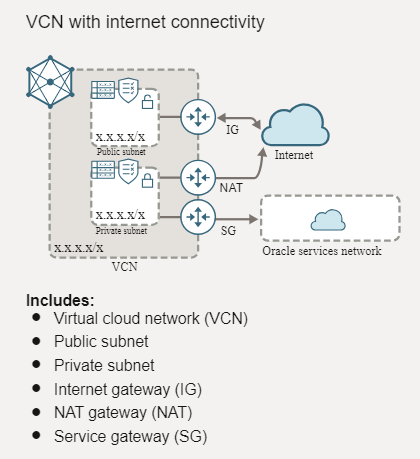

- The only thing we have to do is to provide a VCN Name, let's call our VCN **"analytics_vcn"**
- Click on Next

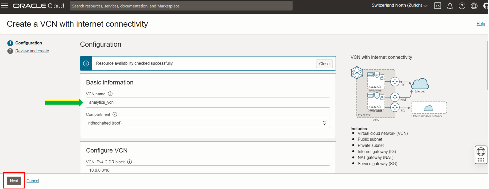

- You can review the details of the resources that will created and click on **"Create"**

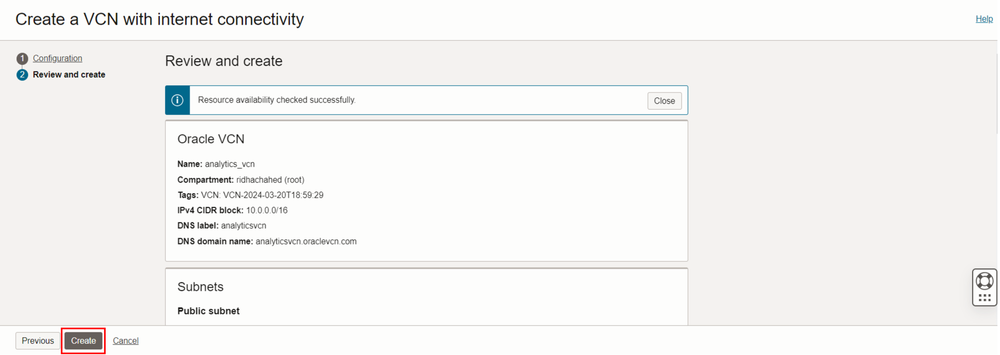

- Once the resources have been created you will see a banner **VCN Creation complete**

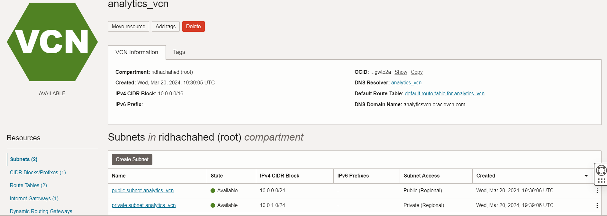

#### Step 4: Configure Security List to Allow MySQL Traffic

The public subnet needs to be configured to allow traffic on the MySQL default port (3306 TCP) so that applications and services, possibly running in other parts of your cloud environment or on the internet, can communicate with your MySQL Database Service. 

- Click on the **"public subnet-analytics_vcn"**

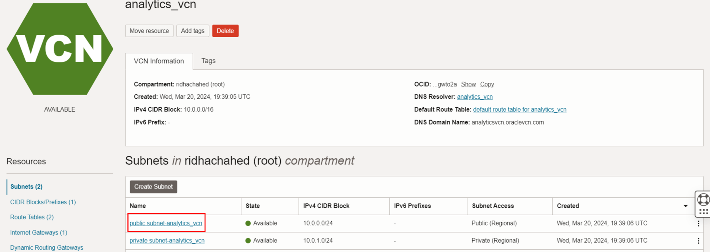

This involves adjusting the security lists associated with the subnet to include rules that permit inbound traffic on the MySQL port (3306).

- Click on the **"Default_Security_List_for_analytics_vcn"** in order to modify it

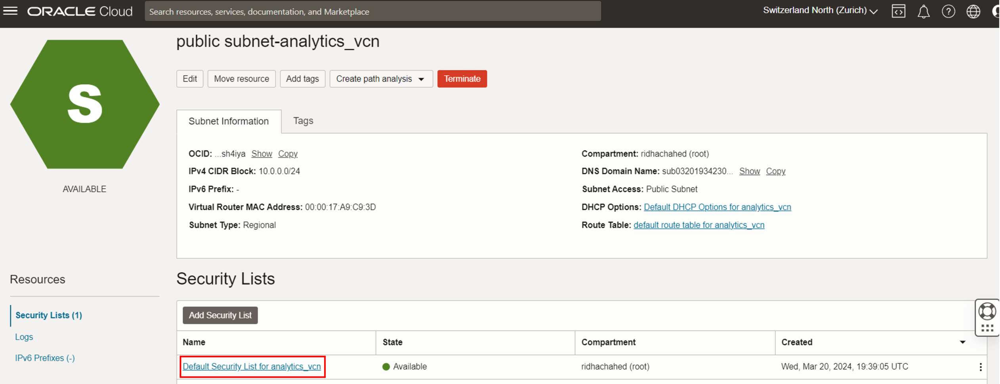

- Click on the **"Add Ingress Rules"** 

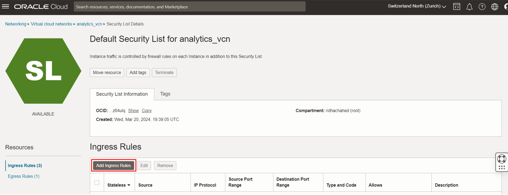

Add the following Ingress Rule:
- Source Type: CIDR
- Source CIDR: Enter your IP range or use 0.0.0.0/0 for universal access (not recommended for production).
- IP Protocol: TCP
- Destination Port Range: 3306 (the default MySQL port)

This rule will allow inbound connections on port 3306, which is used by MySQL.

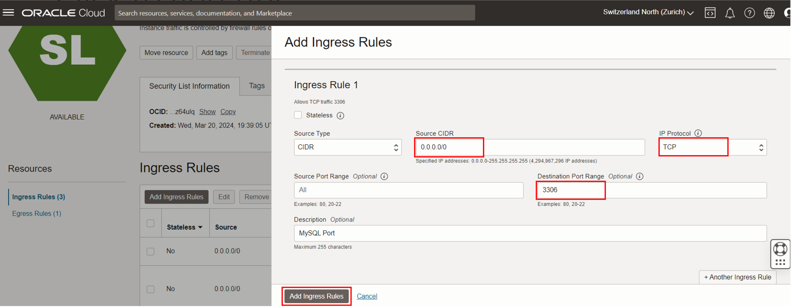

#### Step 5: Verify Your Configuration
Ensure that the VCN, subnets, internet gateway, and route tables are correctly configured.
Double-check the security list rules to ensure that port 3306 is allowed.

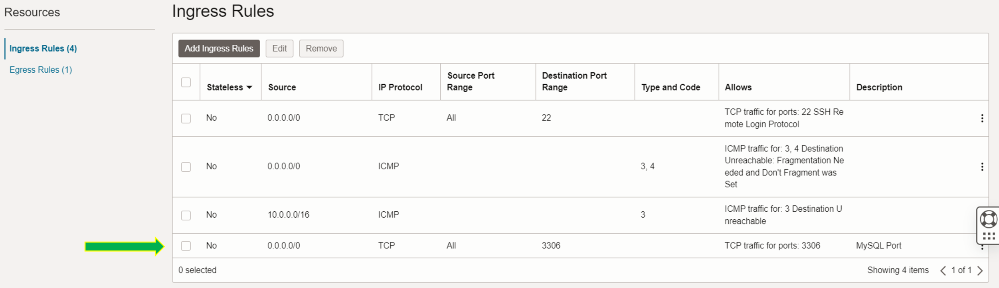

### Conclusion
You have successfully created a Virtual Cloud Network and configured it to allow traffic through the MySQL Database Service port. This setup is crucial for ensuring that your MySQL HeatWave instances can communicate securely within your cloud environment.

Please proceed to the next section of the workshop once you have completed these steps.

