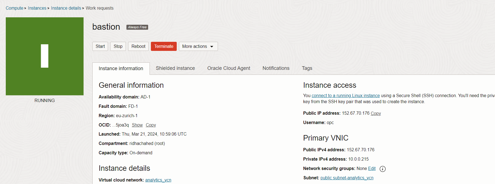

# Setting Up the Bastion Host

Welcome to the second part of our workshop. This section is dedicated to setting up a Bastion Host, an essential component in managing secure access to your cloud resources. Follow the steps below to configure and utilize a Bastion Host effectively.

## Overview 

A Bastion Host serves as a gateway to securely access your private cloud resources from an external network. It acts as a single entry point, reducing the potential attack surface and thereby enhancing your cloud environment's security. The Bastion Host is typically placed in a public subnet but is secured with stringent access rules.

## Objectives 

- Understand the role and importance of a Bastion Host in a secure cloud architecture.
- Learn how to configure a Bastion Host in your Virtual Cloud Network (VCN).

## Prerequisites 

- A functioning OCI environment with a configured VCN.
- Necessary IAM permissions to create and manage compute instances.

## Understanding Key Concepts

Before we proceed with the configuration of the Bastion Host, it’s crucial to grasp some key concepts that underline its importance and functionality in securing cloud environments.

### What is a Bastion Host?
**Definition**: A Bastion Host is a specialized server designed to provide secure access to private network resources from an external network, typically the internet. It acts as a 'jump server' or 'jump host', allowing secure SSH or RDP connections to be made to other internal resources.

**Purpose**: The primary role of the Bastion Host is to limit the exposure of internal resources to external threats, serving as a single, monitored, and controlled access point.

## Step-by-Step Guide

### Step 1: Access the Instances Section

- Once logged in, go to the main dashboard.
- Navigate to the **Compute** section and select **"Instances"**.

### Step 2: Provisioning the Host

- Click on **"Create Instance"**.

- Navigate to the **Compute** section and select **"Instances"**.

- Set the name of the instance as **bastion**.

- By scrolling down you check the Image and Shape details 
- For the Networking information make sure that the VCN selected is the one we created in the previous step i.e.**"analytics_vcn"** with the **"public subnet-analytics_vcn"**.

- Scroll down to the Add SSH Key.
- Click on the **"Save private key"** button provided. The private key should be a .key  file.

The file you are downloading is crucial for securely accessing the Bastion Host. It acts as a cryptographic key that uniquely authenticates your SSH session. You will use the private key later on to connect your compute instance.

- After downloading the private key, you initiate the Bastion Host provisioning by cliking on **"Create"**.

After few seconds, you will be able to see that the Bastion Host instance has a **running** status. 

 

## Conclusion
You have successfully successfully set up a compute instance to function as a bastion host, establishing it as the public gateway to the Virtual Cloud Network (VCN) we crafted earlier. You've securely stored the private key on your local machine, ensuring you're equipped to connect to this Compute Instance. With this foundational setup complete, we're now poised to move forward and initiate the deployment of the MySQL Database Service (MDS) with Heatwave in our upcoming lab!
