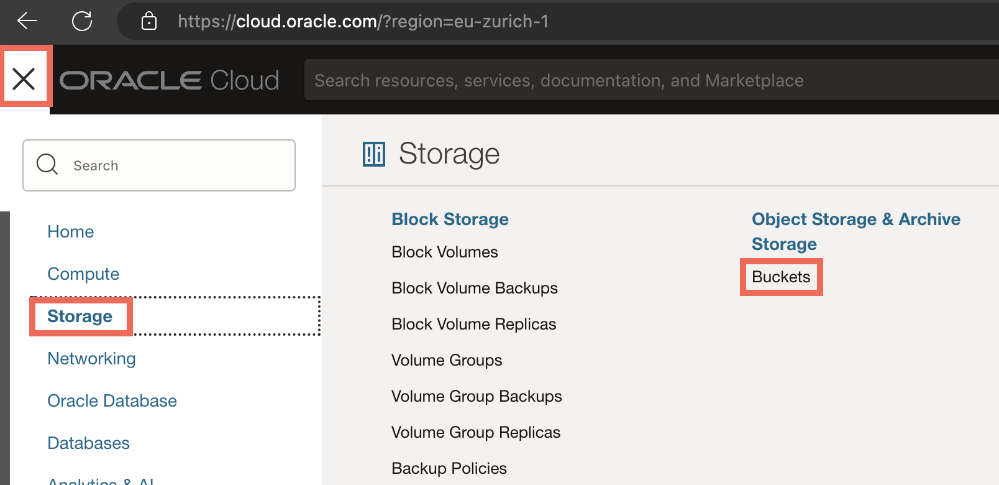
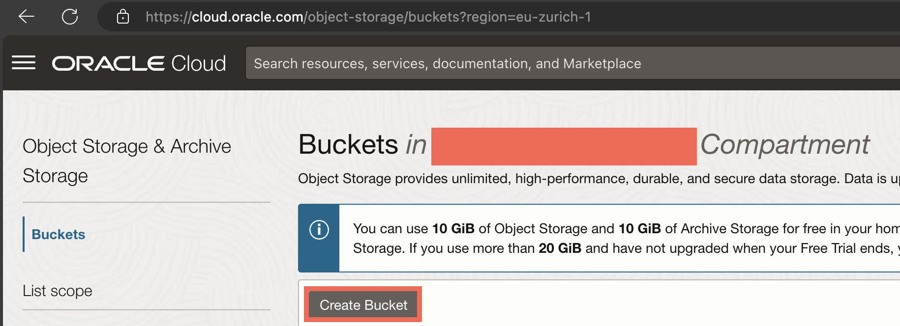
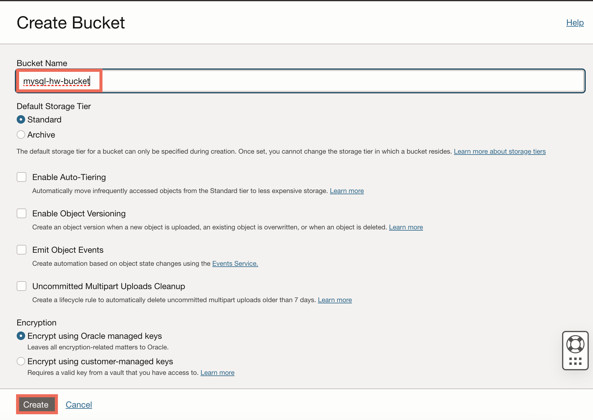
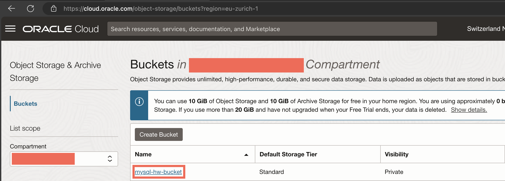
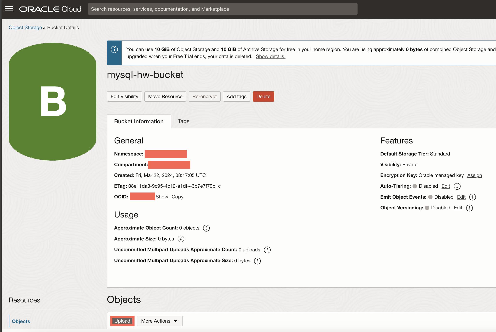
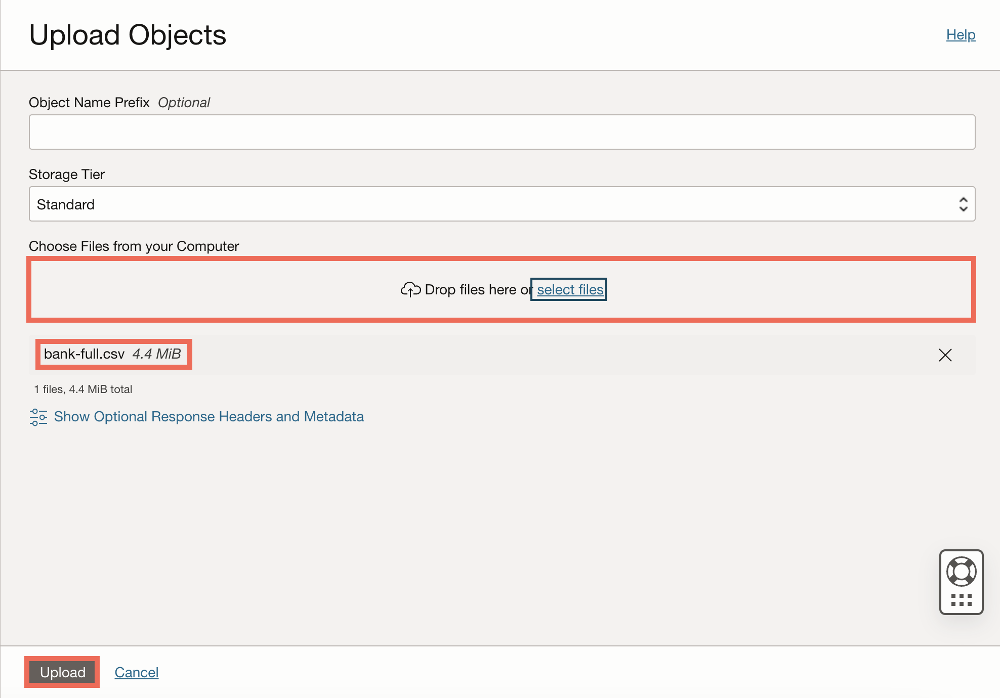
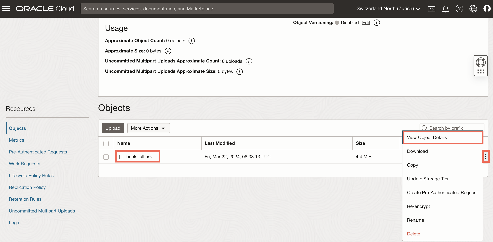
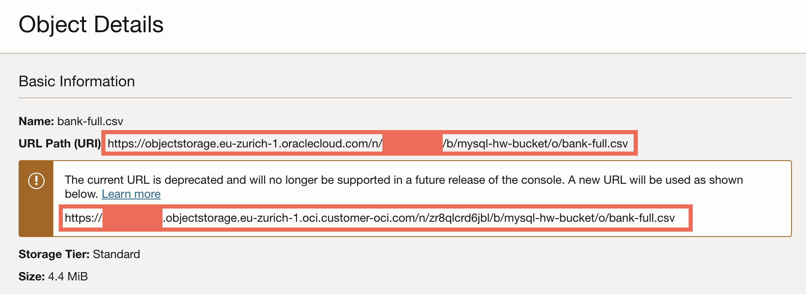

# Create Object Storage bucket and upload files

* Go to *Menu* > *Storage* > *Buckets*.

* Click *Create Bucket*.

* Change the bucket name (e.g. `mysql-hw-bucket`), leave everything else by default. Click *Create*.

* Click on your new bucket to see details.

* On the section *Objects*, click *Upload*.

* Download the dataset [bank_marketing](https://github.com/oracle-samples/heatwave-ml?tab=readme-ov-file) (link in the README) and unzip it.

* Drop the unzipped `bank-full.csv` file on *Choose Files from your Computer*. Leave everything else by default and click *Upload*, then *Close*.

* You will see the new file in the Objects list. Click on the three dots contextual menu and select *View Object Details*.

* Take note of the URL you have. We will need it later.

