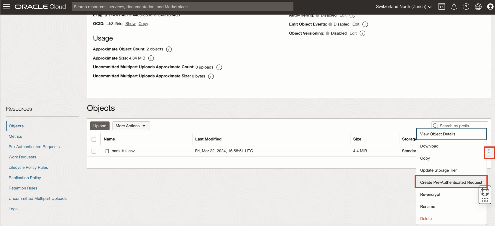
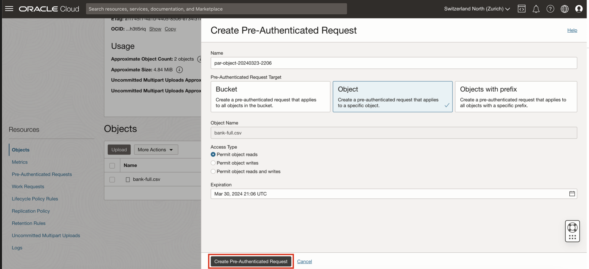
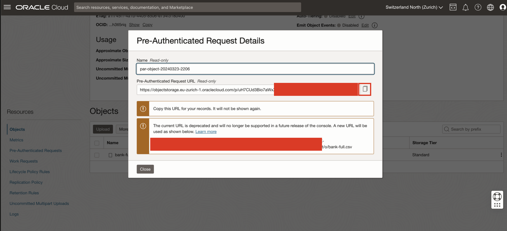

# Create Object Storage bucket and upload unstructured data

## Overview 

This segment of the workshop transitions into the practical aspects of data management within the MySQL HeatWave cloud service environment. 

We focus on leveraging Oracle Cloud Infrastructure's Object Storage service—a highly durable, scalable, and secure platform designed to store and manage vast amounts of data. 

You will learn how to create an Object Storage bucket and upload files to it, a critical step for managing datasets that will be processed and analyzed by MySQL HeatWave.

## Objectives

- Understand how Object Storage complements MySQL HeatWave by providing a robust solution for storing unstructured datasets and facilitating data analytics workflows.

- Learn the step-by-step process to set up a new bucket within Oracle's Object Storage service.

- Upload data files to the Object Storage bucket, preparing data for processing and analysis with MySQL HeatWave.

## Prerequisites
- Active Oracle Cloud Account: Ensure access to Oracle Cloud Infrastructure (OCI) with necessary permissions to create and manage Object Storage services.

- Completed MySQL HeatWave Database Setup: Participants should have a MySQL HeatWave database and cluster already provisioned, as data stored in Object Storage will be utilized by MySQL HeatWave for processing and analytics.

- Familiarity with Cloud Storage Concepts: Basic understanding of cloud storage solutions and their importance in data analytics platforms will enhance learning outcomes.

## OCI Object Storage Service

A "bucket" in the context of cloud storage, including the Oracle Cloud Infrastructure (OCI) Object Storage service, is a basic container that holds data. 

Think of it as a digital version of a physical storage bin where you can store a variety of items. However, instead of physical objects, a bucket in OCI Object Storage contains files and unstructured data such as documents, images, videos, backups, and archives.

The OCI Object Storage service is a scalable, secure, and highly durable cloud storage solution offered by Oracle. It is designed to store and manage vast amounts of data in a distributed environment, providing high availability and redundancy to ensure data is always accessible when needed. 

Object Storage is ideal for storing data that doesn't fit neatly into traditional database structures—hence the term "unstructured data."

We will start by creating a bucket and load unstructured data in it. We will then see how this data can be seamlessly loaded into the MySQL Database, enabling efficient and integrated data analysis workflows without the need for complex data migration processes.

## Step 1: Access the Buckets Section

- Go to *Menu* > *Storage* > *Buckets*.

## Step 2: Create a bucket and name it

- Click *Create Bucket*.

- Change the bucket name (e.g. `mysql-hw-bucket`), leave everything else by default. Click *Create*.

- Click on your new bucket to see details.

## Step 3: Upload the unstructured data files 

- On the section *Objects*, click *Upload*.

- It's now time to upload the data files. For this workshop, we have selected for you a classification dataset. The data is related with direct marketing campaigns (phone calls) of a Portuguese banking institution. The classification goal is to predict if the client will subscribe a term deposit (variable y).

-  You can download the bank_marketing dataset [here](https://archive.ics.uci.edu/ml/machine-learning-databases/00222/bank.zip) and unzip it.

- Drop the unzipped `bank-full.csv` file on *Choose Files from your Computer*. Leave everything else by default and click *Upload*, then *Close*.

## Step 4: Create a Pre-Authenticated Request 

- A Pre-Authenticated Request (PAR) is a unique, secure URL through which the specified object or bucket can be accessed for a limited time period and with specific access rights. In order to easily access the data files afterwards from the Database system we will create a PAR.

-  You will see the new file in the Objects list. Click on the three dots contextual menu and select *Create Pre-Authenticated Request*.

- Validate the PAR creation by clicking on *Pre-Authenticated Request* 

* You can now copy the PAR URL somewhere safe. We will need it later to load the data files in the MySQL Database.

## Conclusion 

Congratulations on creating your first bucket in Oracle Cloud Infrastructure's Object Storage and uploading your dataset! You've taken a significant step forward in your journey with cloud storage and data management. 

As you move forward, the next step in enhancing your cloud infrastructure involves creating a bastion node. This bastion node will serve as a secure gateway, enabling you to connect to your MySQL database system from outside the Oracle Cloud network. By establishing this connection, you'll ensure that you can manage and interact with your database securely, paving the way for more advanced configurations and operations.

[Lab 4: Bastion Host](4-bastion.md)
