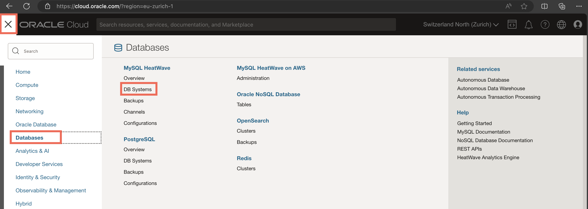
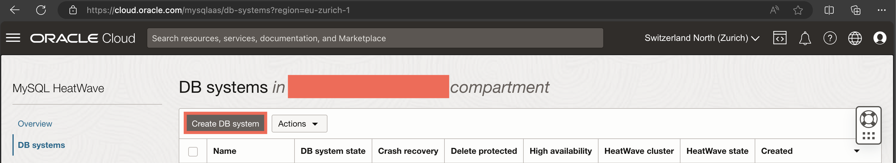
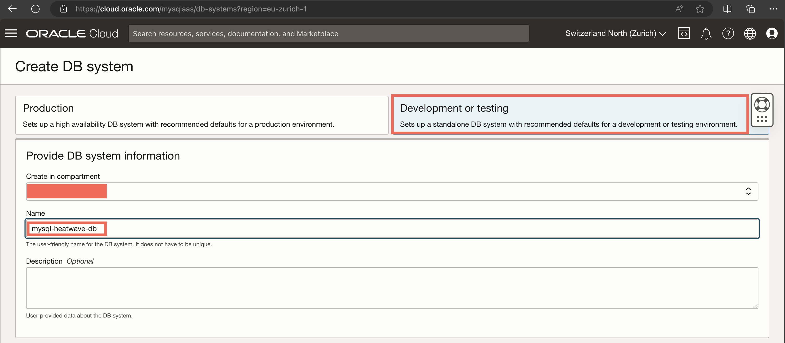
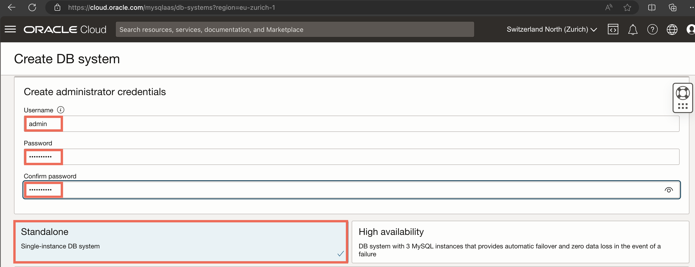
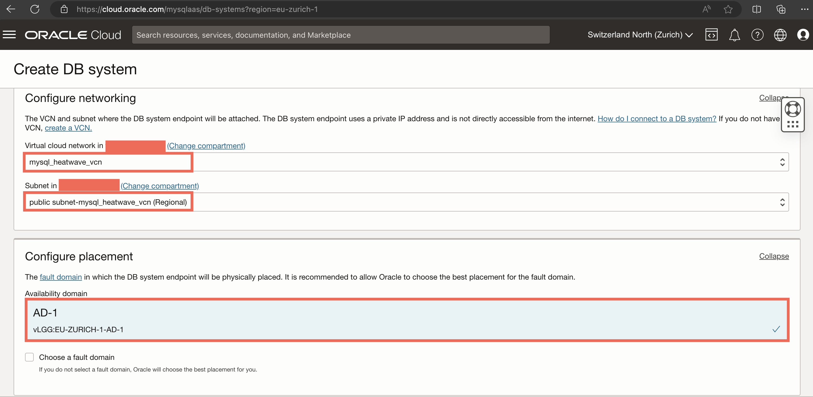
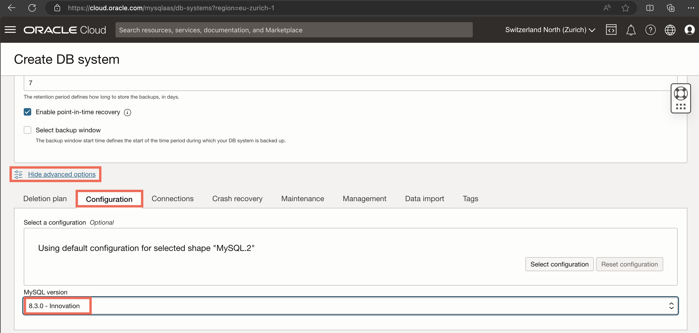
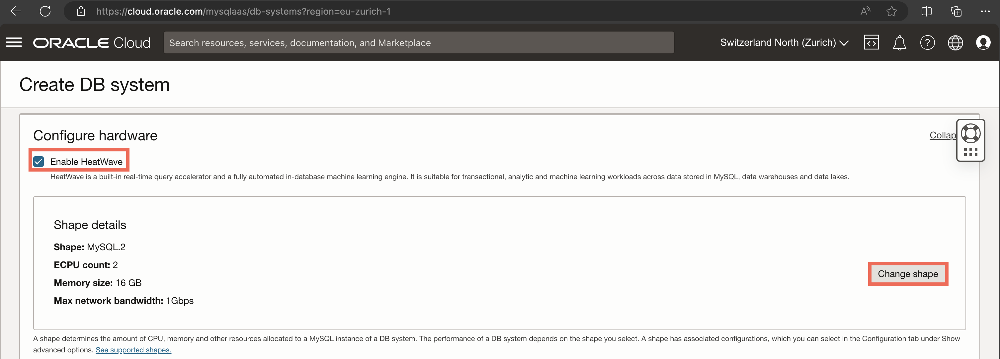
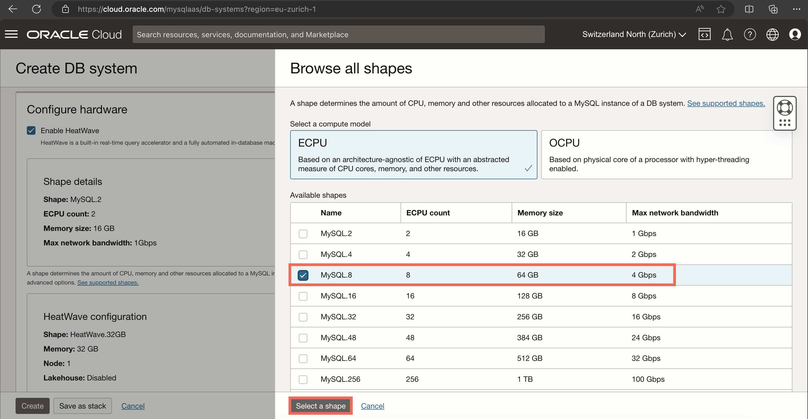
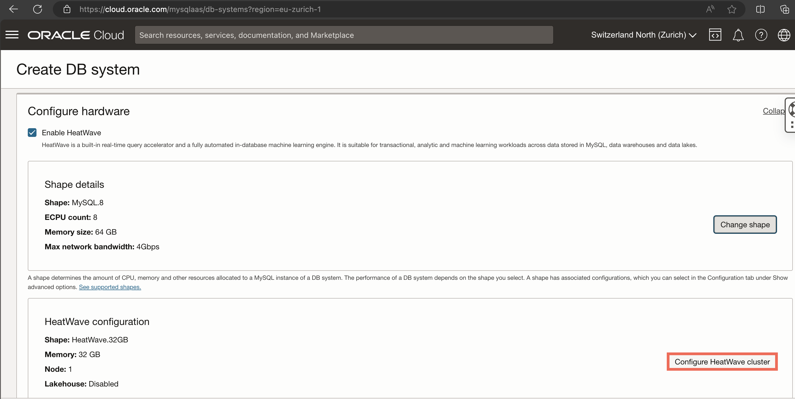
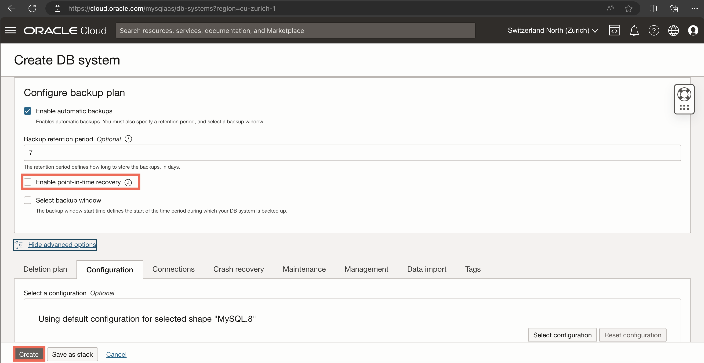

# Setup a MySQL HeatWave DB System

1. On the OCI Console, go to the hamburger menu, then choose *Databases* and *DB Systems* under the MySQL HeatWave section

* From this page, click on *Create DB System*.

* Choose *Development or testing*, then give a name to your DB system.

* Scroll down to *Create administrator credentials*, create username and password, and make sure that *Standalone* is selected.

* Scroll down to the *Configure networking* section. Make sure to choose the VCN and `public` subnet you created in the previous Lab. You can leave the *Configure placement* section unchanged.

* Scroll down to the end of the page first, and click on *Show advanced options*. Change to the *Configuration* tab and choose *8.3.0 - Innovation* as MySQL version. Do not click on *Create* yet!

* Scroll back up to the *Configure hardware* section, and make sure that *Enable HeatWave* is checked. First, we change the configuration of the core MySQL node to MySQL.8, as follows:

Then, we change the configuration of the HeatWave cluster to have 2 nodes and the HeatWave.512GB shape, as well as enable the Lakehouse functionality.

* Finally, scroll down to the *Configure backup plan* section and make sure to `disable` point-in-time recovery, then click on *Create*. Give it a few minutes until all the infrastructure is created for you. Happy HeatWaving!

