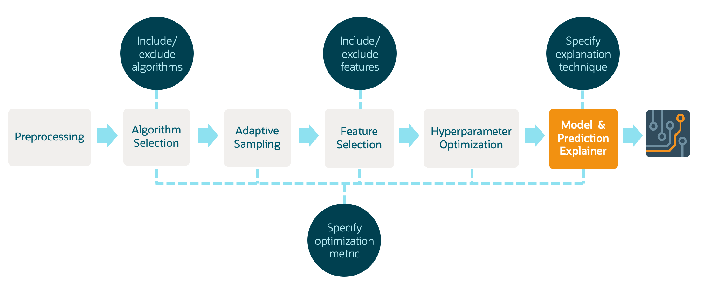
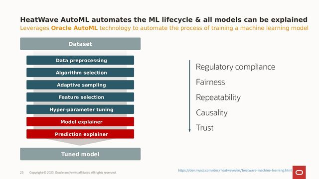

# Machine Learning with Heatwave AutoML and Lakehouse


## Overview
This lab is designed to guide you through the process of loading unstructured data into a Lakehouse table using MySQL and leveraging this data for machine learning applications. We assume that you have already uploaded your unstructured data to an object storage and have a Pre-Authenticated Request (PAR) URL to access this data.

## Objectives:
- Learn to create an external table in MySQL that references unstructured data in object storage.
- Understand how to query unstructured data from a Lakehouse table.
- Explore basic machine learning concepts and apply them to your unstructured dataset.

## Prerequisites:

- Learn to create an external table in MySQL that references unstructured data in object storage.
- Understand how to query unstructured data from a Lakehouse table.
- Explore machine learning concepts and apply them to your unstructured dataset.
- Explain the predicitons of your trained model.


## Part 1: Heatwave Lakehouse for your unstructured data

Building on the strengths of MySQL and the HeatWave query accelerator, the MySQL HeatWave Lakehouse allows direct querying of data across both MySQL databases and data lakes (like those on Amazon S3 or Oracle Object Storage). 

This means that it can perform analytics on a combination of transactional data stored in MySQL and massive datasets stored in data lakes without moving or transforming the data. This integration effectively turns MySQL into a lakehouse, supporting both operational and analytical workloads at scale, thereby eliminating the complexity and delays involved in traditional ETL processes.

LakeHouse tables allow you to query data stored in external storage systems as if it were inside your MySQL database. They are especially useful for managing large, unstructured datasets without importing them directly into your database, offering flexibility and efficiency.


Traditionally, loading data into a high-performance analytics engine could involve several steps, including data transformation, staging, and finally loading, each possibly requiring manual intervention or scripting. **heatwave_load** simplifies this by providing a direct way to load data from MySQL tables into the HeatWave cluster.

The ability of MySQL HeatWave to automatically infer the schema during the data loading process is a significant feature that enhances its usability and efficiency. When you use the heatwave_load function, the system's capability to automatically determine the schema of the data being loaded simplifies the preparation and integration of data for analysis

For more information about Heatwave Lakehouse, have a look at the [Technical Overview](https://www.oracle.com/a/ocom/docs/mysql/mysql-heatwave-lakehouse-technical-brief.pdf).


To locate the data file, a PAR (Pre-Authenticated Request) URL is used to securely access the data in the object storage, ensuring that data access is controlled and secure. More information about PAR can be found [here](https://docs.oracle.com/en-us/iaas/Content/Object/Tasks/usingpreauthenticatedrequests.htm). 


Below is an example of how to use heatwave_load to load the unstructed banking data we have in our bucket. All you have to set is the correct **PAR_URL**:
``` 
CREATE DATABASE ml_data;

USE ml_data; 

SET @db_list = '["ml_data"]';

SET @ext_tables = '[
{
  "db_name": "ml_data",
  "tables": [{
    "table_name": "bank_marketing",
    "dialect": {
        "format": "csv",
         "field_delimiter": ";",
          "record_delimiter": "\\n",
          "has_header": true,
          "skip_rows": 0
      },
    "file": [{
      "par": "<PAR_URL>"
        }]
   }]
}
]';

SET @options = JSON_OBJECT('external_tables', CAST(@ext_tables AS JSON));

CALL sys.heatwave_load(@db_list, @options);

DESCRIBE ml_data.bank_marketing;

SELECT * FROM ml_data.bank_marketing limit 10;
``` 


## Part 2: Heatwave AutoML to train your Machine Learning model 

Once the data is loaded, you can use Heatwave AutoML to train a model on your loaded data. 

HeatWave AutoML is deeply integrated with MySQL HeatWave, allowing users to leverage their existing database infrastructure for machine learning tasks without the need for external tools or platforms.

This integration means that users can easily execute machine learning workflows directly on their operational data stored in MySQL databases, benefiting from HeatWave's high-performance analytics capabilities.

Heatwave AutoML fully automated the entire cycle of data processing and Machine Learning model deployment:

- **Automated Data Preprocessing**: HeatWave AutoML can automatically handle tasks such as missing value imputation, encoding categorical variables, and normalizing or scaling features.

- **Model Selection and Training**: It evaluates multiple machine learning algorithms and configurations to select the best model based on the user's data. This process involves training models on a subset of the data and validating their performance to ensure the selected model performs well on unseen data.

- **Hyperparameter Optimization**: Automatically tunes the hyperparameters of the chosen models to maximize performance, saving users from the complex and time-consuming task of manual tuning.

- **Transparent and Explainable** AI: Offers insights into the model's decisions and predictions, making it easier for users to trust and understand the outcomes of their machine learning models.




``` 
SET @model_bank = "model_bank";

-- Train the model
CALL sys.ML_TRAIN('ml_data.bank_marketing', 'y', JSON_OBJECT('task', 'classification'), @model_bank);

-- Describe the Modal catalog
DESCRIBE ML_SCHEMA_admin.MODEL_CATALOG ;

-- Check the model metadata 
SELECT JSON_PRETTY(model_metadata) FROM ML_SCHEMA_admin.MODEL_CATALOG WHERE model_handle=@model_bank \G

-- Load the model into HeatWave
CALL sys.ML_MODEL_LOAD(@model_bank, NULL);

-- Score the model on the test data
CALL sys.ML_SCORE('ml_data.bank_marketing', 'y', @model_bank, 'accuracy', @score_bank, null);

-- Print the score
SELECT @score_bank;
``` 


After training the model we are ready to use it to make some predictions.

``` 
CREATE TABLE bank_marketing_test
        AS SELECT * from bank_marketing LIMIT 20;
    
CALL sys.ML_PREDICT_TABLE('ml_data.bank_marketing_test', @model_bank, 
        'ml_data.bank_marketing_predictions', NULL);

SELECT * FROM ml_data.bank_marketing_predictions;
``` 

## Part 3: Interpret your model predictions with explainability tools  

Explainability in machine learning, including within the context of MySQL HeatWave AutoML, is a critical aspect that addresses the need to understand and trust the decisions made by machine learning models. 

As machine learning models, particularly complex ones, can often act as "black boxes," where the decision-making process is not transparent, explainability aims to make the workings of these models more understandable to humans. This is crucial for diagnosing issues, ensuring fairness, and complying with regulatory requirements, among other reasons.

The main benefits of explainability in the development of Machine Learning models are: 

- **Trust and Transparency**: Explainability builds trust among users and stakeholders by making it clear how and why decisions are made.
- **Model Improvemen**t: Insights gained from explainable models can guide developers in refining and improving model performance.
- **Compliance and Ethics**: In many industries, being able to explain model decisions is essential for compliance with regulatory standards and ethical considerations.



HeatWave AutoML supports both model explainer and prediction explainer functionalities, covering different use cases.

### Model Explainer
**Focus**: Provides a broad overview of how the model generally makes decisions.

**Insights**: Highlights overall feature importance and model behavior across the dataset.

**Use Case**: Useful for understanding and improving the model, and for explaining its general decision-making process.

Check the Heatwave AutoML [documentation](https://dev.mysql.com/doc/heatwave/en/mys-hwaml-explainers.html) for training explainers.

```
CALL sys.ML_EXPLAIN('ml_data.bank_marketing', 'y', @model_bank, JSON_OBJECT('prediction_explainer', 'permutation_importance'));
```

### Prediction Explainer

**Focus**: Offers detailed reasons behind individual predictions made by the model.

**Insights**: Details the impact of each feature on a specific prediction.

**Use Case**: Essential for analyzing specific decisions, especially in high-stakes or personalized contexts.

Check the Heatwave AutoML [documentation](https://dev.mysql.com/doc/heatwave/en/mys-hwaml-explanations.html) for prediction explanations.

``` 
CALL sys.ML_EXPLAIN_TABLE('ml_data.bank_marketing_test', @model_bank, 
        'ml_data.bank_marketing_test_explanations', 
        JSON_OBJECT('prediction_explainer', 'permutation_importance'));

SELECT JSON_PRETTY(ml_results) FROM ml_data.bank_marketing_test_explanations limit 1 \G
``` 


``` 
SELECT JSON_PRETTY(sys.ML_PREDICT_ROW(JSON_OBJECT(
    'age', bank_marketing_test.age,
    'job', bank_marketing_test.job,
    'marital', bank_marketing_test.marital,
    'education', bank_marketing_test.education,
    'default', bank_marketing_test.default,
    'balance', bank_marketing_test.balance,
    'housing', bank_marketing_test.housing,
    'loan', bank_marketing_test.loan,
    'contact', bank_marketing_test.contact,
    'day', bank_marketing_test.day,
    'month', bank_marketing_test.month,
    'duration', bank_marketing_test.duration,
    'campaign', bank_marketing_test.campaign,
    'pdays', bank_marketing_test.pdays,
    'previous', bank_marketing_test.previous,
    'poutcome', bank_marketing_test.poutcome),
     @model_bank, NULL))
    FROM bank_marketing_test LIMIT 1 \G

SELECT JSON_PRETTY(sys.ML_EXPLAIN_ROW(JSON_OBJECT(
    'age', bank_marketing_test.age,
    'job', bank_marketing_test.job,
    'marital', bank_marketing_test.marital,
    'education', bank_marketing_test.education,
    'default', bank_marketing_test.default,
    'balance', bank_marketing_test.balance,
    'housing', bank_marketing_test.housing,
    'loan', bank_marketing_test.loan,
    'contact', bank_marketing_test.contact,
    'day', bank_marketing_test.day,
    'month', bank_marketing_test.month,
    'duration', bank_marketing_test.duration,
    'campaign', bank_marketing_test.campaign,
    'pdays', bank_marketing_test.pdays,
    'previous', bank_marketing_test.previous,
    'poutcome', bank_marketing_test.poutcome),
     @model_bank, JSON_OBJECT('prediction_explainer', 'permutation_importance')))
    FROM bank_marketing_test LIMIT 1 \G
``` 

